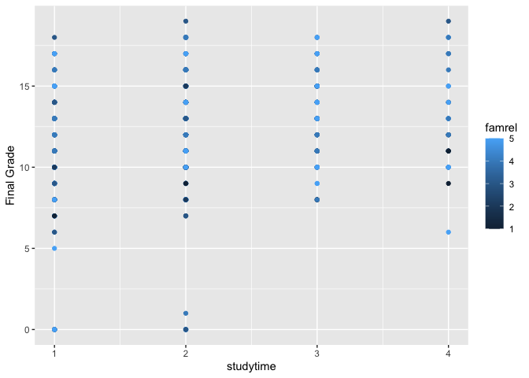
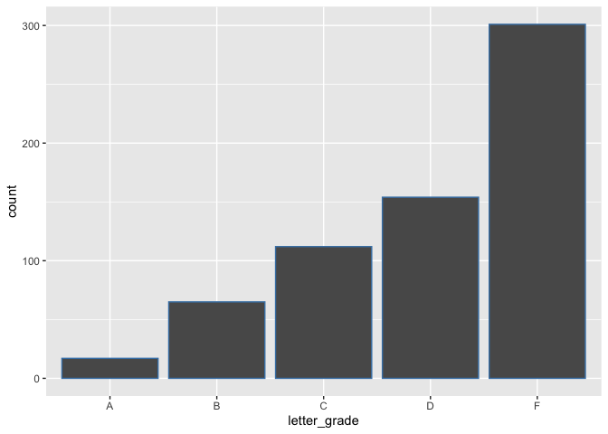
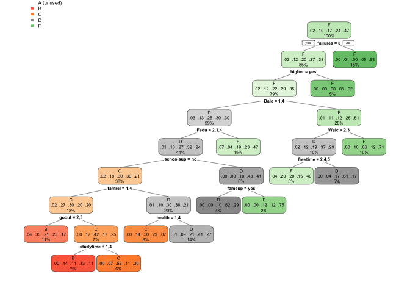

# Introduction

## What Do Students Need? Investigating High School Performance

In this project, I aim to gain insight on what aspects affect a
student’s school performance. Specifically, this project analyzes a
dataset compiled from two Portuguese high schools, and contains 33
variables that range from school performance and information to
demographic and social factors. More details on this study, and how its
data was compiled, can be found in this [public
paper](http://www3.dsi.uminho.pt/pcortez/student.pdf). Documentation on
the variables and their values can be found in the data folder of this
repo, in `students.txt`

``` r
#first going to install and load in all necessary packages
#install.packages("tidyverse")
#install.packages("tidymodels")
#install.packages("rpart")
#install.packages("rpart.plot")
#install.packages("caret")

library(tidyverse)
library(tidymodels)
library(rpart)
library(rpart.plot)
library(caret)
```

# Exploring The Data

The dataset is split in two - one for math scores and one for Portuguese
scores.They contain all of the same variables, of which there are 33. I
choose to focus on just the Portuguese dataset for this project.

``` r
port_df <- read_delim("data/student-por.csv")
```

Most of the columns’ data are stored as either a double or character
data type, when they should in fact be categorized as factors. Many of
the columns are questionnaire questions, where the student was asked to
rank say, their quality of familial relationship on a scale of 1 to 5.
Additionally, there are columns, like “activities” and “internet” that
are answered either character strings Yes or No, meaning I should
convert almost all of the columns into categorical variables before
conducting any kind of classification model.

However, before modeling I explore the set to gain some insights on its
variables.

    ##  [1] "school"     "sex"        "age"        "address"    "famsize"   
    ##  [6] "Pstatus"    "Medu"       "Fedu"       "Mjob"       "Fjob"      
    ## [11] "reason"     "guardian"   "traveltime" "studytime"  "failures"  
    ## [16] "schoolsup"  "famsup"     "paid"       "activities" "nursery"   
    ## [21] "higher"     "internet"   "romantic"   "famrel"     "freetime"  
    ## [26] "goout"      "Dalc"       "Walc"       "health"     "absences"  
    ## [31] "G1"         "G2"         "G3"

I am going to exclude the following columns from analysis: school, sex,
age, address, Pstatus, Mjob, Fjob, reason, guardian, G1, and G2 (please
note that the variables “G1”, “G2”, and “G3” refer to term grades, with
G1 and G2 being the students grade in the first two terms of the year,
and G3 being the final grade in the course, and is scored out of 20). I
am mostly interested in the categorical variables about the students’
social and familial life - for example I do not wish to include whether
their parents are separated or whether they have parents(which is why I
am omitting the columns “Pstatus” and “guardian”), but I do want to
include variables like “goout” and “famrel” which categorizes whether
they go out with friends or the quality of their familial relationships
respectively.

``` r
port_df <- port_df %>%
  select(-school, -sex, -age, -address, -Pstatus, -Mjob, -Fjob, -reason, -guardian, -G1, -G2)
```

``` r
#the following plots to see the distribution of the variable in question
port_df %>%
  ggplot(aes(x = G3)) +
  geom_histogram(bins = 20, color = "steelblue") +
  labs(title = "Distribution of Final Grades",
       x = "Grade (out of 20)",
       y = "Count")
```


``` r
port_df %>%
  ggplot(aes(x = G3))+
  geom_boxplot(color = "steelblue")+
  labs(title = "Distribution of Final Grades")
```


The histogram illustrates that this variable is normally distributed,
albeit a bit left skewed, with a singular peak happening around the
mean/median (since they are so close in valuable they can both be taken
as a measure of center). We can also see that there are a few outliers
occurring in the lower end of the distribution.

``` r
#creating a custom summarizing function
stats_summary <- function(df, var){
  df %>%
    summarise(mean = mean({{var}}),
              median = median({{var}}),
              sd = sd({{var}}),
              min = min({{var}}),
              max = max({{var}}))
}
#creating a function to group_by an explanatory variable and summarise a response variable
group_summary <- function(df, exp_var, resp_var){
  df %>%
    group_by({{exp_var}}) %>%
    summarise(mean = mean({{resp_var}}),
              median = median({{resp_var}}),
              sd = sd({{resp_var}}),
              min = min({{resp_var}}),
              max = max({{resp_var}}))
}

stats_summary(port_df, G3)
```

    ## # A tibble: 1 × 5
    ##    mean median    sd   min   max
    ##   <dbl>  <dbl> <dbl> <dbl> <dbl>
    ## 1  11.9     12  3.23     0    19

``` r
port_df %>%
  ggplot(aes(x = studytime, y = G3, color = famrel)) +
  geom_point() +
  labs(y = "Final Grade")
```



Presumption might lead us to think that those who spend more time
studying would get higher grades, but we can see there seems to be
(direct or obvious) correlation/trend between an increase in study time
and an increase in grade performance.

``` r
group_summary(port_df, failures, G3)
```

    ## # A tibble: 4 × 6
    ##   failures  mean median    sd   min   max
    ##      <dbl> <dbl>  <dbl> <dbl> <dbl> <dbl>
    ## 1        0 12.5    12    2.83     0    19
    ## 2        1  8.64   10    3.44     0    16
    ## 3        2  8.81    9.5  3.21     0    15
    ## 4        3  8.07    8.5  2.79     0    11

Unsurprisingly, it seems that there is a trend that students who have
failed classes before tend to score lower overall. It seems that there
is a steep drop off in average grade just after the first level of the
failure variable - those who have failed at least one class have
significantly lower summary statistics than those who have never failed
a class before.

All of the variables in question are categorical; I am going to create a
new column which is the letter grade version of G3.

``` r
#converting G3
port_df <- port_df %>%
  mutate(letter_grade = case_when(
    G3 >= 18 ~ "A",
    G3 >= 16 ~ "B",
    G3 >= 14 ~ "C",
    G3 >= 12 ~ "D",
    TRUE ~ "F"))
```

``` r
port_df %>%
  ggplot(aes(x = letter_grade)) +
  geom_histogram(color = "steelblue", stat = "count")
```

    ## Warning in geom_histogram(color = "steelblue", stat = "count"): Ignoring
    ## unknown parameters: `binwidth`, `bins`, and `pad`



We can see that the vast majority of the students at this school did not
perform well.

``` r
#converting all columns to factor data type, then converting absences and G3 back to numeric
port_df <- port_df %>%
  mutate_at(colnames(port_df), factor)
port_df <- port_df %>%
  mutate(absences = as.numeric(absences))
port_df <- port_df %>%
  mutate(G3 = as.numeric(G3))
```

# Modeling

Next, after officially converting all columns to the factor data type,
we can attempt to train and fit a model.The response variable in this
instance is going to be letter_grade, which means this will be a
multi-nomial classification - because of this I am going to use a
decision tree.

``` r
set.seed(122)
#partitioning into training and split
port_split <- initial_split(port_df, strata = letter_grade)
port_train <- training(port_split)
port_test <- testing(port_split)
```

``` r
#decision tree
#excluding G3

port_tree <- rpart(letter_grade ~ . -G3,
                   data = port_train,
                   method = "class")
```

``` r
rpart.plot(port_tree, fallen.leaves =FALSE)
```



# Conclusion

We can see that the first splitting question the tree asks is whether
the student has failed a class before or not, and we noted that as a
helpful indicating factor in predicting school performance. The next
question it asks is whether or not the student intends to pursue higher
education. As the tree branches, we can see that the questions become
more about their social lives - do they go out, do they have good family
relations, do they have study time, that leads to more non-F
predictions.

``` r
port_predict <- predict(port_tree, port_test, type = "class")
```

``` r
confusionMatrix(port_predict, port_test$letter_grade)
```

    ## Confusion Matrix and Statistics
    ## 
    ##           Reference
    ## Prediction  A  B  C  D  F
    ##          A  0  0  0  0  0
    ##          B  2  5  5  9  2
    ##          C  2  3  7  6  5
    ##          D  3  3  7  8 15
    ##          F  1  5  9 15 52
    ## 
    ## Overall Statistics
    ##                                           
    ##                Accuracy : 0.439           
    ##                  95% CI : (0.3618, 0.5185)
    ##     No Information Rate : 0.4512          
    ##     P-Value [Acc > NIR] : 0.6517          
    ##                                           
    ##                   Kappa : 0.1821          
    ##                                           
    ##  Mcnemar's Test P-Value : 0.1727          
    ## 
    ## Statistics by Class:
    ## 
    ##                      Class: A Class: B Class: C Class: D Class: F
    ## Sensitivity           0.00000  0.31250  0.25000  0.21053   0.7027
    ## Specificity           1.00000  0.87838  0.88235  0.77778   0.6667
    ## Pos Pred Value            NaN  0.21739  0.30435  0.22222   0.6341
    ## Neg Pred Value        0.95122  0.92199  0.85106  0.76562   0.7317
    ## Prevalence            0.04878  0.09756  0.17073  0.23171   0.4512
    ## Detection Rate        0.00000  0.03049  0.04268  0.04878   0.3171
    ## Detection Prevalence  0.00000  0.14024  0.14024  0.21951   0.5000
    ## Balanced Accuracy     0.50000  0.59544  0.56618  0.49415   0.6847

We can see that this model is best at predicting the F class - this is
unsurprising because it makes up about 47% of the whole sample.
Additionally, the model predicted no A’s, since that only made up 2% of
the sample. The next steps to make a more attuned model, would be to
address this class imbalance before training and fitting a model. How
would the model predict if it trained on a sample that had the same
proportion of each class?

Although this model is not the most accurate, we can begin to gain some
insight into the aspects of student life that affect school performance.
Past failures being a high indicator of further poor performance tells
us that those students need extra help and attention, as a past failure
might psychologically hinder a student from believing they can achieve
more. Additionally, we can see that the aspirations to go on to higher
education is a slight indicator of performance, and is again connected
to student confidence. Additionally, we can gather that students with
robust social lives, students who do extracurricular activities and go
out, do not perform worse than those who have more free time. With all
of these in mind, we can begin to understand the needs of adolescents to
encourage better school performance.

### Citation

P. Cortez and A. Silva. Using Data Mining to Predict Secondary School
Student Performance. In A. Brito and J. Teixeira Eds., Proceedings of
5th Future Business Technology Conference (FUBUTEC 2008) pp. 5-12,
Porto, Portugal, April, 2008, EUROSIS, ISBN 978-9077381-39-7.
